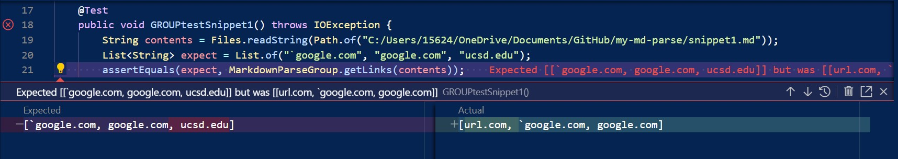

# [Week 8 Lab Report](https://github.com/bhacia/cse15l-week8-labreport4)

## Links to the 2 repos that'll be featured in this repo:

- My repo: [bhacia/markdown-parse](https://github.com/bhacia/markdown-parse)
- Other group's repo: [YueSteveYin/MarkDownParseGroup](https://github.com/YueSteveYin/MarkDownParseGroup)

## Based on [the CommonMark demo site](https://spec.commonmark.org/dingus/), each snippet produces the following:

- **Snippet 1** 
    - In other words: [`google.com, google.com, ucsd.edu]
 
- **Snippet 2** 
    - In other words: [a.com, a.com(()), example.com]

- **Snippet 3** 
    - In other words: [https://ucsd-cse15l-w22.github.io/]
  
## Test Implementations

You can get the code of each test [here](https://github.com/bhacia/cse15l-week8-labreport4/blob/main/MarkdownParseTest.java), however I'll be adding both implementations below!
  
### My Implementation

- Snippet 1 
    - The green check mark on the left indicates that my test snippet 1 passed.
  
- Snippet 2 
    - The green check mark on the left indicates that my test snippet 2 passed.
  
- Snippet 3 
    - The red x mark on the left indicates that my test snippet 3 failed.
    - JUnit output of test failure: 
  
### Other Group's Implementation
  
- Snippet 1 
    - The red x mark on the left indicates that their test snippet 1 failed.
    - JUnit output of test failure: 
  
- Snippet 2 
    - The red x mark on the left indicates that their test snippet 2 failed.
    - JUnit output of test failure: 
  
- Snippet 3 
    - The red x mark on the left indicates that their test snippet 3 failed.
    - JUnit output of test failure: 
  
## Q & A
  
- Do you think there is a small (<10 lines) code change that will make your program work for snippet 1 and all related cases that use inline code with backticks?
    - My program worked for snippet 1, however I'm not sure if it'd work for all related cases with inline code with backticks. For my code, I added a condition for if a backtick is right before the open bracket, similarly to the condition for testing images vs. links.
    - The other group's program didn't work, so they could make a small code change by adding a condition for if a backtick is right before the open bracket, like what they did to check for an image with the exclamation point.

- Do you think there is a small (<10 lines) code change that will make your program work for snippet 2 and all related cases that nest parentheses, brackets, and escaped brackets?
    - My program worked for snippet 2 and I'm more confident that it'd work for all related cases with nested parentheses, brackets, and escaped brackets. I believe my only issue is for the closed parentheses. I believe there could be a small change checking that there's either a space or no other characters after the closed parentheses, rather than the method I chose since mine is more selective.
    - The other group's program didn't work, so they could make a small code change using my previous idea. They can check if the character after the closed parentheses is a space or nothing, which could potentially indicate that that is indeed the correct closing parentheses. If the character after is none of those, then they can update the closed parentheses value by searching for the next closed parentheses after 1 + the old closed parentheses value.

- Do you think there is a small (<10 lines) code change that will make your program work for snippet 3 and all related cases that have newlines in brackets and parentheses?
    - Both programs failed, so we both could definitely make some changes, however, I believe it'd have to be more involved changes.
    - As you can see in both of our markdown parse java files, our main methods reads the contents of a file line by line, assuming that every link won't take up more than one line. To change this would screw up our whole program; therefore a bigger change would have to take place, in which we'd no longer look at files line by line.
